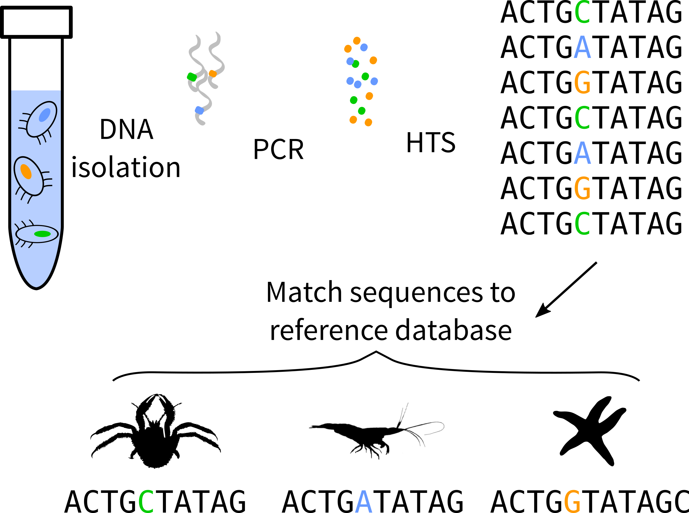

```{r setup, message=FALSE, echo=FALSE}
library(tidyverse)
library(remake)
library(devtools)
library(remake)
library(hrbrthemes)

load_all("~/R-dev/labmanager")
```

# We don't know enough about biodiversity

to predict the impact of human activites

- What are the impacts of perturbations, pollution?
- Which species are invasive?
- How does global change affect communities?

--

### How many species?
### What are the species?
### Where do they live?

---

# We don't know enough about biodiversity


### How many species?

```{r, echo=FALSE, fig.width=10, fig.height=5, dev='CairoSVG'}

data.frame(
    source = c("Described Species (WoRMS)",
               "Appletans et al (2012) -- model",
               "Appletans et al (2012) -- model",
               "Appletans et al (2012) -- experts",
               "Appletans et al (2012) -- experts",
               "Costello et al (2013)",
               "Costello et al (2013)",
               "Mora et al (2011)",
               "Poore & Wilson (1993)",
               "Grasslet & Maciolek (1992)"),
    estimate_type = c("expert",
                      "stat model (low)",
                      "stat model (high)",
                      "expert (low)",
                      "expert (high)",
                      "stat model (low)",
                      "stat model (high)",
                      "extrapolation",
                      "extrapolation",
                      "extrapolation"),
    number_species = c(226000,
                       320000,
                       760000 - 320000,
                       704000,
                       972000 - 704000,
                       5000000 - 3000000,
                       5000000 + 3000000 - 2000000,
                       2200000,
                       5000000,
                       10000000),
    stringsAsFactors = FALSE) %>%
    ggplot(aes(x = reorder(source, number_species), y = number_species, fill = estimate_type)) +
    geom_col() +
    theme_minimal() +
    coord_flip() +
    xlab("Source") + ylab("Number of Species") +
    theme(legend.position = "none")

```

---

# Where is the data coming from?

* Expert faunistic lists

  - most comprehensive, limited in geographic scope

--

* Museum specimens

  - identifications can be validated, not everything digitized
  - **iDigBio**

--

* Described species

  - almost complete, only captures described species
  - **WoRMS**

--

* Species occurences

  - good for species ranges, difficult to validate
  - **GBIF, OBIS**

--

* DNA barcoding

  - **BOLD**

---

# Where does the data come from?

## Until recently data has been scattered

### **First synthesis of knowledge for marine invertebrates**

* How much of what we know is captured in these databases?

* How much do we know?

---

# Expert lists

```{r list_stats, echo=FALSE, include=FALSE}
owd <- setwd("~/Dropbox-uf/dark-taxa-plankton")
gom_worms_ <- remake::fetch("gom_worms")
kozloff_worms_ <- remake::fetch("kozloff_worms")
create_bindings()
plot_gom <- plot_richness_per_db(filter(summary_richness_per_db_gom,
                                        taxon_name != "Platyhelminthes",
                                        taxon_name != "Nematoda"),
                                 data_source = "Gulf of Mexico",
                                 region = "gom") +
      theme_bw(base_size = 18) +
    xlab("") + theme(legend.position = "none")
plot_koz <- plot_richness_per_db(filter(summary_richness_per_db_koz,
                                        taxon_name != "Platyhelminthes"),
                                 data_source = "Pacific NW",
                                 region = "pnw") +
    theme_bw(base_size = 18) +
    xlab("") + theme(legend.position = "none")

map_sampling <- make_heatmap_sampling(data_map_sampling_effort,
                                      "Number of samples") +
    theme(legend.position = "bottom")
map_diversity <- make_heatmap_sampling(data_map_diversity,
                                       "Number of species") +
    theme(legend.position = "bottom")
plot_sampling <- plot_sampling_effort(data_map_standardized_diversity)

idig_samples_through_time <- plot_cum_samples_through_time(
    idigbio_samples_through_time, facet = FALSE) +
    theme_bw() + ylab("Number of samples")

idig_spp_through_time <- plot_cum_spp_through_time(
    idigbio_samples_through_time, facet = FALSE
) + theme_bw() + ylab("Number of species")

p_bold_table <- p_bold_match %>%
    dplyr::select(taxon_name = phylum,
           p_has_bold = p_match)

prop_barcoded <- dplyr::bind_rows(
               gom = bold_status(gom_bold),
               koz = bold_status(kozloff_bold),
               all_idigbio = bold_status(idigbio_bold),
               plankton = p_bold_table,
               .id = "data_source"
               ) %>%
    dplyr::mutate(taxon_name = capitalize(taxon_name)) %>%
    dplyr::filter(
               taxon_name %in% c("Annelida", "Arthropoda",
                                 "Cnidaria",
                                 "Echinodermata", "Mollusca",
                                 "Porifera"
                                 )
           ) %>%
            ggplot(aes(x = reorder(taxon_name, p_has_bold), y = p_has_bold, fill = data_source)) +
            geom_col(position = "dodge") +
            xlab("") + ylab("Proportion of species with available DNA barcodes") +
            scale_fill_viridis(discrete = TRUE,
                               name = "Data source",
                               labels = c("all iDigBio", "Gulf of Mexico", "Pacific NW", "Florida Plankton")) +
    coord_flip() +
    theme_bw()

p_singleton <- calc_prop_singleton_species(idigbio_records)

p_less_than_5 <- idigbio_records %>%
    group_by(worms_valid_name) %>%
    tally() %>%
    mutate(n_less_5 = n <= 10) %>%
    filter(!is.na(n_less_5)) %>%
    .$n_less_5 %>%
    mean.default(na.rm = TRUE)

p_less_than_5 <- format_output(p_less_than_5 * 100)

p_not_since_1980 <- calc_prop_species_not_collected_since(idigbio_records, 1980)

n_spp_comp <- calc_n_spp_comparison(idigbio_samples_through_time)

delete_bindings()
setwd(owd)

```


* Kozloff's 1987 "Marine Invertebrates of the Pacific Northwest"

  - `r sum(kozloff_worms_$is_marine, na.rm=TRUE)` species

* Felder and Camp's 2009 "Gulf of Mexico Origin, Waters, and Biota"

  - `r sum(gom_worms_$is_marine, na.rm=TRUE)` species

---

.pull-left[

```{r, echo=FALSE, dev="CairoSVG", fig.height=13}
plot_koz
```
]

.pull-right[

```{r, echo=FALSE, dev="CairoSVG", fig.height=13}
plot_gom
```
]

---

# Museum Records

```{r, echo=FALSE, dev="CairoSVG", fig.height=5.5}
map_sampling
```
---

# Museum Records

```{r, echo=FALSE, dev="CairoSVG", fig.height=5.5}
map_diversity
```

---

# Museum Records

```{r, echo=FALSE, dev="CairoSVG", fig.height=5.5}
plot_sampling
```

---

# Museum Records

```{r, echo=FALSE, dev="CairoSVG", fig.height=5.5, warning=FALSE}
idig_spp_through_time
```

---

# We don't know enough about biodiversity


- Proportion of species known from a single specimen: **`r p_singleton`%**
- Proportion of species known from less than 10 specimens: **`r p_less_than_5`%**
- Proprotion of species not collected since 1980: **`r p_not_since_1980`%**
- Number of species added:
  + between 1960 and 1970: **`r n_spp_comp$n_spp_1970_1960`**
  + since 2000: **`r n_spp_comp$n_spp_2017_2000`**
- Need more information about small phyla

---

# Future approaches

## Using metabarcoding


---

# Future approaches

## Using metabarcoding



---

```{r, echo=FALSE, dev="CairoSVG", fig.height=13}
plot_gom
```

---

# Future approaches

## Using metabarcoding

* improve taxonomic assignment of DNA sequences

--

* estimate community phylogenies

--

## Conclusion

> Better understanding of ecological and historical processes that are shaping
> marine biodiversity.

---
class: inverse, center, middle

# Questions?
